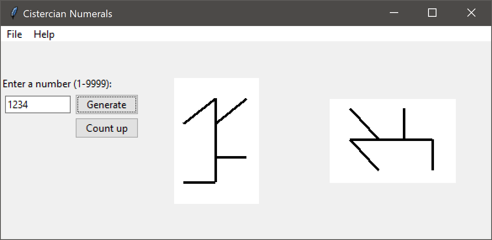
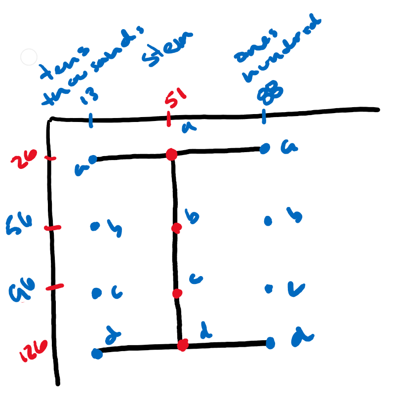
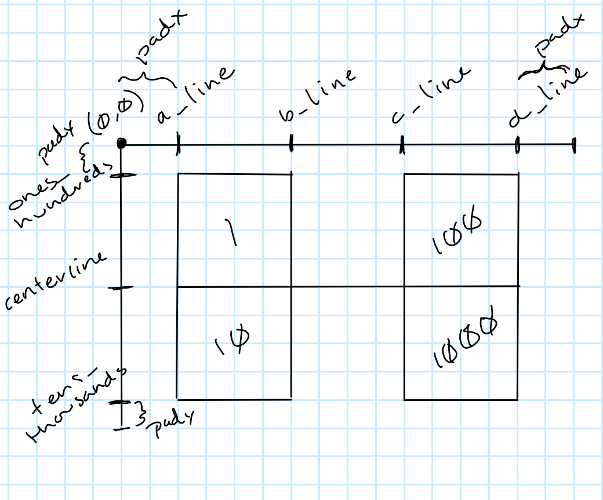

Cistercian Numeral Generator
============================

"The medieval Cistercian numerals, or "ciphers" in nineteenth-century parlance, were developed by the Cistercian monastic order in the early thirteenth century at about the time that Arabic numerals were introduced to northwestern Europe. They are more compact than Arabic or Roman numerals, with a single glyph able to indicate any integer from 1 to 9,999.

Digits are based on a horizontal or vertical stave, with the position of the digit on the stave indicating its place value (units, tens, hundreds or thousands). These digits are compounded on a single stave to indicate more complex numbers. The Cistercians eventually abandoned the system in favor of the Arabic numerals, but marginal use outside the order continued until the early twentieth century." - [wikipedia](https://en.wikipedia.org/wiki/Cistercian_numerals)

CistercianNumerals.py contains a class which generates such numbers, CistercianNumerals_gui.py contains a Tkinter application used for testing and demonstration. As demonstrated in the example on the left below, the ones digit is in the top right position, the tens digit in the top left, the hundreds digit in the bottom right, and the thousands digit in the bottom left. In the horizontal version, the numeral is shifted 90* counterclockwise.

### Example

A brief summary of the numerals can be seen here:

.svg)

Screenshot of CistercianNumerals_gui application -- hardcoded points are on left number, while right number is generated based on height and width with the horizontal flag set:

### Dependencies

None. :)

### Use

    import CistercianNumerals

    cng = CistercianNumeralGenerator(width, height, flipped=False, horizontal=False, padx=0, pady=0)

    cng.draw_number(<number>)

width:      x-axis

height:     y-axis

flipped:    set to true if origin is at bottom left, default to top left

horizontal: set to true for numerals generated horizontally

padx:       x-axis padding

pady:       y-axis padding

draw_number: Returns list of tuples of points to draw lines of form: [((x1,y1),(x2,y2)), ((x1,y1),(x2,y2)), ...]

In the example above, the output of `cng.draw_number(1234)` was used with Tkinter's `canvas.create_line()` method to draw the lines.

### Diagrams

I am sorry for the poor quality of these diagrams, but these were used in the creation of this class:

Vertical:

Horizontal:

